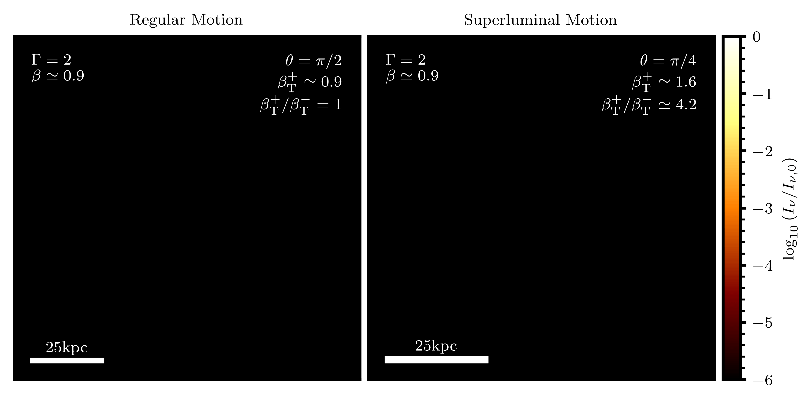
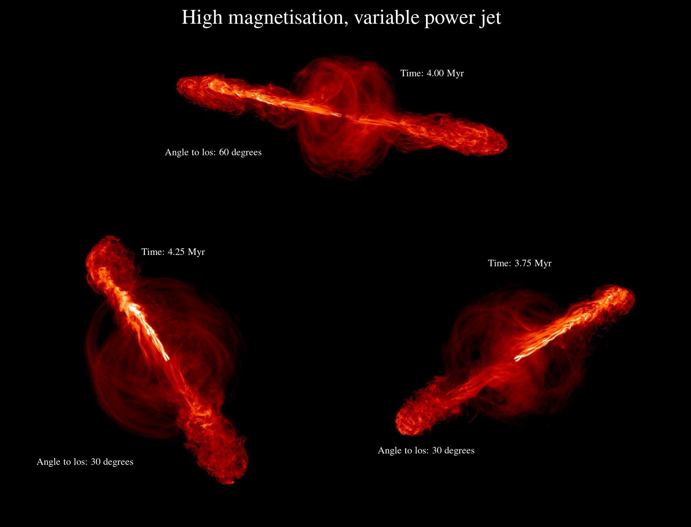

.. cuDART documentation master file, created by
   sphinx-quickstart on Thu May 28 13:59:00 2026.
   You can adapt this file completely to your liking, but it should at least
   contain the root `toctree` directive.

cuDART
======

:code:`cuDART` is a relativistic ray-tracing code designed to post-process simluation data into synthetic observations of optically thin emission. 
Generating such visualisations, especially from arbitrary viewpoints and for large simulation datasets, can prove very expensive due to the large 
number of cells that a pixel's line-of-sight may intersect with. In :code:`cuDART` two acceleration structures are implemented to triviliase this computation: 
GPU acceleration and DDA, the Digital Differential Analyzer. DDA allows for iterative low-cost propagation of rays through regular Cartesian meshes; together with the CUDA toolkit
this allows for exceptionally fast line-of-sight summation. :code:`cuDART` supports rendering utilising relativistic boosting and a finite speed of light, allowing for geometric effects 
such as superluminal motion to be recovered. :code:`cuDART` supports simulation data with a globally contant mesh resolution, and data that can be partitioned into subdomains of locally fixed resolution.

    Animation showing synthetic radio observations of mock data featuring relativistic anti-parallel twin ejecta launched at angles of 90 and 45 degrees to the line-of-sight 
    (left and right panels respectively). In both panels, each of the ejecta has the same absolute velocity, but display different observed transverse velocities. 
    :code:`cuDART` automatically accounts for relativistic effects (the ejectum pointed toward the observer is brigther by relativistic beaming), and geometric effects
    (the approaching ejectrum exhibits a greater transverse velocity and is deformed along the line-of-sight).

    Synethic radio observations of hydrodynamic simulation data, highly magnetised, variable power jet launched from an Active Galactic Nucleus, viewed from three different orientations. 
    Relativistic beaming results in a brighter advancing jet and dimmer receding jet; this effect is strongest when the jet is more closely aligned with the line-of-sight. 
    Simulation data featured in Elley at al. 2026 (`NASA ADS <https://ui.adsabs.harvard.edu/abs/2026arXiv260513469E/abstract>`_).

The workhorse of the :code:`cuDART` code is written in C++/CUDA, but the frontend is build in Python. The full codebase is available on `GitHub <https://github.com/hwhitehead/cuDART>`_. 
Please report any issues and suggestions for improvement here. Development for :code:`cuDART` is use-case driven; if there are projects that you think may benefit from this code, but requires additional features
please get in touch with the authors.

---------------------------------------
Publications
---------------------------------------

Earlier iterations of this codebase have been use to generate synethic observations for the following publications:

* Gasealahwe et al. (2025): `A relativistic jet from a neutron star breaking out of its natal supernova remnant <https://ui.adsabs.harvard.edu/abs/2025MNRAS.541.4011G/abstract>`_,
* Elley et al. (2026): `The impact of flickering variability and magnetisation on the dynamics, stability and morphology of radio-loud AGN jets <https://ui.adsabs.harvard.edu/abs/2026arXiv260513469E/abstract>`_.

---------------------------------------
Development
---------------------------------------

Authors and contributors to the :code:`cuDART` code and their institutions are:

Henry Whitehead
    DPhil candidate, Department of Physics, Astrophysics, University of Oxford, Denys Wilkinson Building, Keble Road, Oxford, OX1 3RH, UK

----------------
Acknowledgements 
----------------

:code:`cuDART` relies on the publically available (and internally included) `libnpy <https://github.com/llohse/libnpy>`_ library to read :code:`.npy` files into memory.
Development of this code was supported by `this <https://www.scratchapixel.com/lessons/3d-basic-rendering/introduction-acceleration-structure/grid.html>`_ excellent guide on 
acceleration structures in C, and `this <https://developer.nvidia.com/blog/accelerated-ray-tracing-cuda/>`_ developer blog on constructing ray tracers with CUDA. 
Much of the formatting for this documentation page is taken from the superior documentation for the `SIROCCO <https://sirocco-rt.readthedocs.io/en/latest/>`_ radiative transfer code.

.. toctree::
    :titlesonly:
    :glob:
    :hidden:
    :caption: Documentation

    install
    inputs
    example
    api
    calculation
    phenomena
