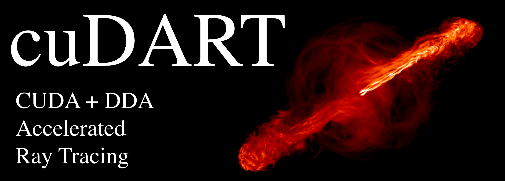
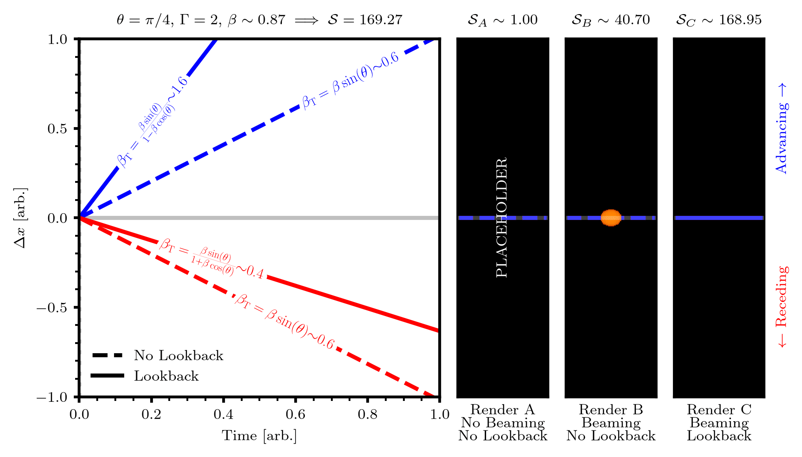

.. cuDART documentation master file, created by
   sphinx-quickstart on Thu May 28 13:59:00 2026.
   You can adapt this file completely to your liking, but it should at least
   contain the root `toctree` directive.

.. _index_header:

.. image:: https://img.shields.io/badge/Github-CUDART-4475A0.svg?style=for-the-badge&logo=github&logoColor=white
   :target: https://github.com/hwhitehead/cuDART

.. image:: https://img.shields.io/badge/arXiv-PENDING-b31b1b.svg?style=for-the-badge
   :target: https://github.com/hwhitehead/cuDART

|

Synthetic Observations of Relativistic Sources
----------------------------------------------

cuDART is a relativistic ray-tracing code designed to post-process simluation data into synthetic observations of optically thin emission. 
Generating such visualisations, especially from arbitrary viewpoints and for large datasets, can prove very expensive due to the large 
number of simulation cells that an image pixel's line-of-sight may intersect with. In cuDART two acceleration structures are implemented to triviliase this computation: 
GPU parallelisation and 3DDDA, the 3D Digital Differential Analyzer. 3DDDA allows for iterative low-cost propagation of rays through regular Cartesian meshes; together with the CUDA GPU toolkit
this allows for exceptionally fast line-of-sight summation. cuDART automatically accounts for a range of relativistic and geometric effects
such as Doppler boosting. Unlike previous visualisation schemes which generally consider a single snapshot in time, cuDART is
capable of accounting for a finite time delay between emission and observation by rendering data from multiple epochs simultaneously. 
Including this delay allows for the recovery of various relativistic phenomena normally absent from synthetic observations.

    Figure comparing the observed properties of a simulation domain featuring twin anti-parallel relativistic ejecta, when imaged under three different schemes with increasing levels of complexity. 
    Each scheme produces different observational features, notably reporting different transverse velocities :math:`\beta_\mathrm{T}`, emitter morphologies and flux ratios :math:`\mathcal{S}`. 
    Only the most complex (and cuDART's default) scheme, accounting for relativistic beaming and finite time delay produces results that agree with relativistic and geometric theory. 
    See :ref:`this <phenomena_header>` page for full discussion.

.. figure:: ../../gallery/magnetised_jets.png
    :width: 800px

    Synthetic radio observations of hydrodynamic simulation data (featuring highly magnetised, variable power jet launched from an Active Galactic Nucleus) viewed from three different orientations. 
    Relativistic beaming results in a brighter advancing jet and dimmer receding jet; this effect is strongest when the jet is more closely aligned with the line-of-sight. 
    Simulation data featured in Elley at al. 2026 (`NASA ADS <https://ui.adsabs.harvard.edu/abs/2026arXiv260513469E/abstract>`_).

The bulk of cuDART is written in C++/CUDA, but the frontend is built in Python. The full codebase is available on `GitHub <https://github.com/hwhitehead/cuDART>`_. 
Please report any issues and suggestions for improvement there, or get in contact with the development lead (Henry Whitehead, henry[dot]whitehead[at]ist[dot]ac[dot]at). Development for cuDART is use-case driven; if there are projects that you think may benefit from this code, but require additional features
please get in touch.

------------
Publications
------------

Earlier proprietary iterations of this codebase (pre v1.0) have been used to generate synthetic observations for the following publications:

* Gasealahwe et al. (2025): `A relativistic jet from a neutron star breaking out of its natal supernova remnant <https://ui.adsabs.harvard.edu/abs/2025MNRAS.541.4011G/abstract>`_,
* Elley et al. (2026): `The impact of flickering variability and magnetisation on the dynamics, stability and morphology of radio-loud AGN jets <https://ui.adsabs.harvard.edu/abs/2026arXiv260513469E/abstract>`_.

-----------
Development
-----------

Developerment of cuDART is currently led by

Henry Whitehead

- ISTA Fellow, Institute of Science and Technology Austria 
- Previously, DPhil candidate, University of Oxford
- `Personal Website <https://hwhitehead.github.io/>`_

The developer would like to thank Emma Elley and Katie Savard for beta testing early iterations of the codebase,
and thank Christopher Everett, Frasier Cowie, James Matthews and many others for insightful discussions during development.

----------------
Acknowledgements 
----------------

cuDART uses an adapted version of the publically available `libnpy <https://github.com/llohse/libnpy>`_ library to read :code:`.npy` files from storage into memory.
Development of this code was supported by `this <https://www.scratchapixel.com/lessons/3d-basic-rendering/introduction-acceleration-structure/grid.html>`_ excellent guide on 
acceleration structures in C, and `this <https://developer.nvidia.com/blog/accelerated-ray-tracing-cuda/>`_ developer blog on constructing ray tracers with CUDA. 
Much of the formatting for the cuDART documentation is taken from the vastly superior codebase for the `SIROCCO <https://sirocco-rt.readthedocs.io/en/latest/>`_ radiative transfer code.

.. toctree::
    :titlesonly:
    :hidden:
    :maxdepth: 2
    :caption: Physics Documentation

    calculation
    phenomena

.. toctree::
    :titlesonly:
    :hidden:
    :maxdepth: 2
    :caption: Code Documentation

    install
    example
    inputs
    api
    performance
    structure

