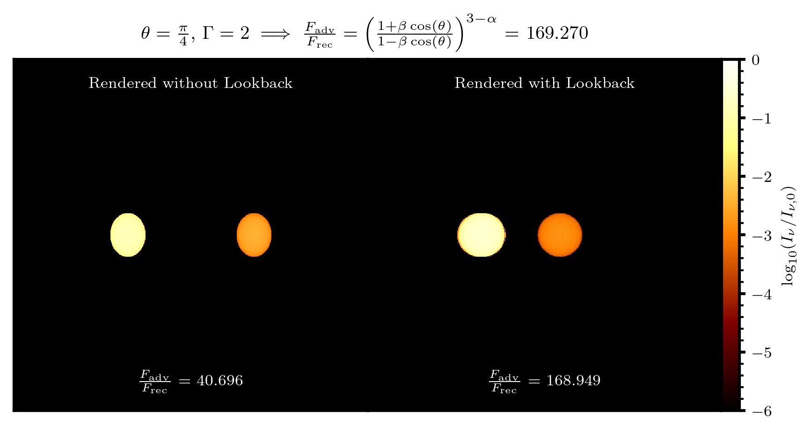

.. _lookback:

Lookback
########

In :code:`cuDART`, the use of lookback refers to performing a render while accounting for a finite speed of light. This means that when a ray samples a cell within a simulation domain,
it ensures that it reads in data from the proper snapshot in time, as appropriate for this position in space. For an observation made at :math:`t=t_\mathrm{obs}`, the time sampled along 
the ray path given by :math:`\boldsymbol{x} = \boldsymbol{x}_0 + s \hat{\boldsymbol{s}}` will be given by 

.. math::
    \bar{t} = t_\mathrm{obs} - \frac{|\boldsymbol{x} - \boldsymbol{x}_0|}{c} = t_\mathrm{obs} - \frac{s}{c}

For systems that are slowly evolving in time, this formulation is unimportant; all cells along the line of sight can be assumed to be sampled at the same time. However, for rapidly evolving 
systems, especially with velocities closely aligned to the line-of-sight, including this effect is incredibly important. Consider the following test problem, featuring two emitting regions travelling 
in opposite directions at :math:`\Gamma = 2`. These regions are spheres in their own rest frames; in the lab frame they are oblate spheroids with an axial ratio of :math:`\Gamma` due to Lorentz contraction. The minor axis
of the spheroid is aligned with its velocity. The figure below depicts the result of rendering this system when the velocity of the ejecta are aligned at :math:`\theta = \pi / 4`

Relativistic effects in the form of beaming is accurately captured: both with and without lookback enabled, the approaching ejectum (left blob in each panel) is brighter than the receeding ejectum. This is because 
radiation that is isotropic in the ejectum frame is beamed towards the direction of motion. However, the morphology and luminosity of each system is markedly different. In the left panel, rendered without lookback,
the emitting regions are visibly ellipsoidal, as it their lab frame structure. However, it is known that due to the finite light travel time between the near and far surfaces of the emitter, an object which is spherical 
it its own rest frame should be observed as a sphere (this is known as the `Penrose-Terrell <https://en.wikipedia.org/wiki/Terrell_rotation>`_ effect). This effect is only recovered when lookback is turned on (the right panel), 
here the emitting regions are spheres (up to the spatial resolution set by the sampling rate, see :ref:`here <phenomena_aliasing>`). A fun visualisation of this effect is included in `this <https://www.desmos.com/calculator/ccozioekuo>`_
interactive Desmos plot; see how even when changing the velocity :math:`\beta` and orientation :math:`a` of the ejecta has no effect on the observed extent of the region (made from :math:`(0,-5)` in the :math:`+y` direction).

Perhaps most importantly, because the morphology of the emitting regions is not captured accurately without lookback, their total luminosities are also incorrect. A standard relativistic result is that as :math:`I_\nu / \nu^3` is Lorentz 
invariant; for an ejectum with homogenous velocity and rest-frame emission given by a power law :math:`j'_\nu \propto \nu^{\alpha}`, the intensity in the emitter and lab frame can be connected by :math:`I_\nu = D^{3-\alpha} I'_{\nu'}`. 
Here :math:`D = \gamma^{-1} (1-\beta\cos(\theta))^{-1}` is the relativistic Doppler factor. For small angular sources (explictly here, for plane-parallel rays), the total flux recieved from the emitting region can be expressed as

.. math::
    F_\nu = \int_\mathrm{source} I_\nu(\omega,\psi) \cos(\omega) d\omega = \frac{D^{3-\alpha}}{d^2} \int j'_\nu dV 

where here :math:`d\Omega = \sin(\omega)d\omega d\phi` is the solid angle element subtended by the source, and :math:`d` is the distance to the source. As the ejecta are moving in opposite directions (e.g. :math:`\theta_\mathrm{adv} = \theta_\mathrm{rec} + \pi`)
, the ratio in flux between the approaching and receeding ejecta can be expressed as 

.. math::
    \frac{F_\mathrm{adv}}{F_\mathrm{rec}} = \left(\frac{1+\beta \cos(\theta)}{1-\beta \cos(\theta)}\right)^{3-\alpha}. 
    
The above figure reports this quantity for renders with/without the lookback functionality. We can see that with lookback enabled, the calculated ratio matches the theoretical prediction to around 0.2% (limited by the finite resolution of the domain in space and time).
However, without lookback enabled, the calculated ratio is off by a factor 4. This is problematic for comparing true and synthetic observations, as the ratio of fluxes is a common metric to estimate the orietation of a relativistic ejectum to the
line of sight. This emphasises the importance of including finite speed of light effects in the rendering computation, as otherwise synthetic obervations will produce incorrect intensities, morphologies and fluxes. 