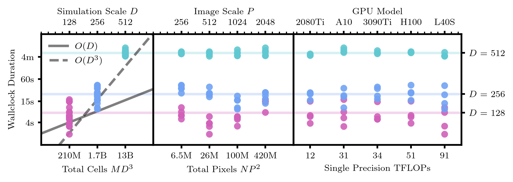
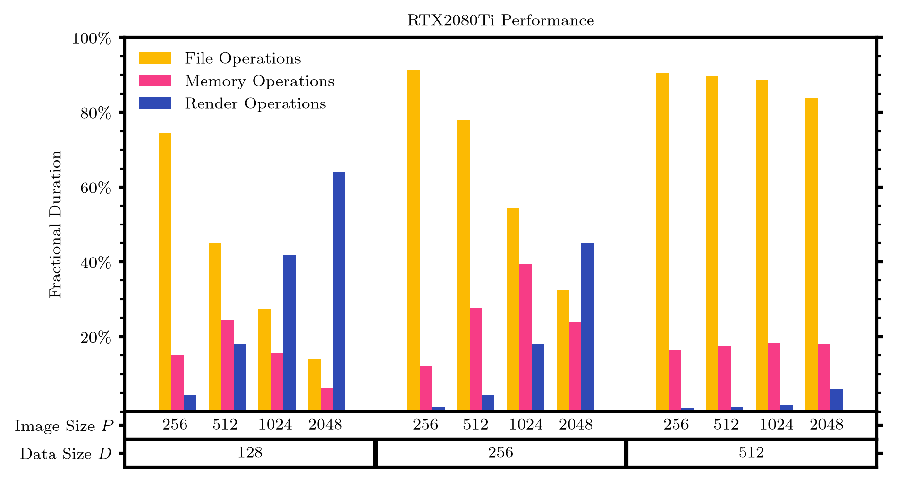

.. _performance_header:

Performance and Profiling
#########################

The main contributors to runtime during the C++ execution of cuDART are (in order of execution):

1. Reading simulation datafrom storage to host (.npy to RAM) 
2. Data transfer from host to device (RAM to VRAM)
3. Rendering the data on the device (GPU execution)
4. Data transfer from host to device (VRAM to RAM)
5. Writing the image data to storage (RAM to .npy)

The cost of reading files usually represents a significant fraction of the total runtime, making the user's
I/O environment a significnantsource of performance discrepancy. We recommend the user performs profiling tests 
relevant to their own environment using the automated tools proviedd (see :ref:`below <performance_tools>`).

Here we report a series of performance metrics for renders produced using various GPUs on the Institute of Science and Techonology Austria's Scientific Computing Cluster. 
Each test was run with a single CPU/GPU, each test loads :math:`M` snapshots of mock simulation data each containing :math:`D^3` cells, using the lookback routine to generate :math:`N` renders each composed of :math:`P^2` pixels. 

Acceleration Structures
-----------------------

In the worst case scenario, where a render routine has no prior knowledge of the intersections between cells and pixel rays, a computation of the type used 
for performance testing here scales as :math:`O(D^3P^2NM)`. For a relatively modest input dimension of :math:`\{D,M,P,N\}=\{512,100,100,512\}` this amounts to a 
staggering :math:`O(10^{17})` potentially cell-ray intersections. In practice, cuDART massively reduces complexity by

1. *3DDDA*: only consider cells in ray path
2. *Fast-forward*: skip cells on ray path with no time overlap 
3. *GPU parallelisation*: compute pixel values simultaneously

In combination, these acceleration structures reduce the complexity of the *render* operation to simply :math:`O(D)`. 
In practice, the cost of the render operation represents only a small fraction of the total runtime, with the majority of the wallclock duration occupied with reading 
large simulation datasets from storage into host memory. As serial file read cost scales directly with file size, this results in 
"file-read bottlenecked" for most reasonably sized datasets, scaling with :math:`O(D^3)`. As a consequence, the wallclock duration
for most problems shows little to no dependence on the number of pixels in the image, or the GPU model used (see figures below).

Performance Scaling
-------------------

    Durations for the C++ render routine when running with lookback generating :math:`N=100` images each sampling :math:`M=100` snapshots. 
    Performance shows little dependence on both the number of pixels in the image and the GPU model used, despite a wide range of theoretical performance ceilings considered (as measured in TFLOPS). 
    The size of simulation dataset :math:`D` has the most effect on the runtime, with duration scaling as :math:`O(D)` for small datasets, and :math:`O(D^3)` for large datasets (as the system becomes more read bottlenecked, see figure below.) 

    Fractional contribution to runtime for a series of renders performed using a RTX2080Ti, changing the simulation size :math:`D` and image size :math:`P`. 
    All renders were performed using the lookback routine, yielding :math:`N=100` images each scanning :math:`M=100` snapshots. 
    Small simulations (:math:`D=128`) see comparative contributions from file and render operations depending on the image size :math:`P`, but for larger simulations, 
    the cost of file reads completely dominates the runtime and changing the image size :math:`P` has negligible effect. 
    Fractional durations are measured with respect to the wallclock duration, asynchronous device-host execution means the sum of operation fractions is not necessarily :math:`100\%`.

.. _performance_tools:

Automated Profiling Tools
-------------------------

cuDART comes packaged with a lightweight wrapper to the :code:`nsys` (NVIDIA Nsight System) profiling toolkit.
To profile the execution of the C++ backend, set :code:`save_profile = True` when calling :code:`Scene.render`, this will prepend
the subprocess call to the C++ executable with a call to :code:`nsys profile`, generating a series of logfiles in the same output
directory as the rendered data (set using :code:`save_dir` on :code:`Scene` init). Results from these logfiles can then be printed to
the command line using the :code:`Profiler` class (see Pythonic API :ref:`here <python_api_header>`). Caution is warranted when interpreting 
the timings produced, as much of the GPU/CPU execution is asynchronous and so the total task duration will be in excess of the true wallclock. 
When :code:`Scene.render` is called with :code:`verbose_cpp = True`, the C++ executable will print a series of timestamps to the command line;
these times track the system clock, a cumulative wallclock duration is output as :code:`wallclock.txt` in the output directory. Below we show 
an example of the output written to the command when when :code:`Profiler.report()` is called on the output directory. 
The dataset used for this run has properties :math:`\{D,M,P,N\}=\{512,100,512,100\}` and was run on a RTX2080Ti.

.. code-block:: bash

    Reporting Duraton Summary
    WARNING: execution is asynchronous, sum of task durations may exceed wallclock
    Reported Wallclock Duration = 275.474s

    GPU Summary:
       Time (%)  Total Time (ns)  Instances     Avg (ns)     Med (ns)   Min (ns)  \
    0      87.3      23893202376        100  238932023.8  238692939.5  237315268
    1      12.5       3415192214      10000     341519.2     354527.5     124640
    2       0.1         37905114      10001       3790.1       3553.0       3455
    3       0.0          9577022          1    9577022.0    9577022.0    9577022
    4       0.0          1321084        100      13210.8      12816.0      12320
    5       0.0          1061410        100      10614.1      11200.0       8704
    6       0.0           796379        100       7963.8       7247.5       7136

        Max (ns)  StdDev (ns)     Category  \
    0  245047561    1083072.7  MEMORY_OPER
    1     396159      40744.5  CUDA_KERNEL
    2       6144        485.8  CUDA_KERNEL
    3    9577022          0.0  MEMORY_OPER
    4      17632       1221.6  CUDA_KERNEL
    5      14848       1768.4  CUDA_KERNEL
    6      10144       1192.4  CUDA_KERNEL

                                               Operation
    0                                 [CUDA memcpy HtoD]
    1  render_from_mesh(Camera, float *, Mesh **, Tra...
    2                          wipe_img(Camera, float *)
    3                                 [CUDA memcpy DtoH]
    4                            free_mesh(Mesh **, int)
    5  init_meshblock(MeshBlockInfo, MeshBlock **, fl...
    6              init_mesh(Mesh **, MeshBlock **, int)

    OSRT Summary:
        Time (%)  Total Time (ns)  Num Calls      Avg (ns)     Med (ns)  Min (ns)  \
    0       51.3     550027984091       5525  9.955258e+07  100149701.0       638
    1       25.6     275068383907        551  4.992167e+08  500093872.0   9303994
    2       23.0     246799172912        237  1.041347e+09     354553.0       576
    3        0.0        370824795       1330  2.788156e+05      62679.5      1204
    4        0.0        100903521        255  3.957001e+05      13852.0      1703
    5        0.0         89529217        100  8.952922e+05     874581.5    842187
    6        0.0         41131457        203  2.026180e+05     215694.0     74302
    7        0.0          5002640         56  8.933290e+04      15727.5     11642
    8        0.0          2793848      10216  2.735000e+02         84.0        41
    9        0.0          2520337         23  1.095799e+05      40423.0     18567
    10       0.0          1840392          4  4.600980e+05     464229.0    151270
    11       0.0          1771520         24  7.381330e+04      21450.5      5778
    12       0.0          1110085         28  3.964590e+04       2255.0      1184
    13       0.0          1109153          3  3.697177e+05     322152.0    217161
    14       0.0           620591          1  6.205910e+05     620591.0    620591
    15       0.0           528778         12  4.406480e+04         36.0        23
    16       0.0           517846         13  3.983430e+04      27501.0      2916
    17       0.0           507866         57  8.909900e+03       6754.0      3589
    18       0.0           436137          5  8.722740e+04        270.0       161
    19       0.0           425723         61  6.979100e+03       6526.0      3068
    20       0.0           413261        204  2.025800e+03         78.0        49
    21       0.0           408521         16  2.553260e+04       8315.0      4524
    22       0.0           209077          1  2.090770e+05     209077.0    209077
    23       0.0            48114          3  1.603800e+04      16379.0     11560
    24       0.0            45175          6  7.529200e+03       7694.0      3200
    25       0.0            34703          4  8.675800e+03       7901.5      6065
    26       0.0            26582          2  1.329100e+04      13291.0      8402
    27       0.0            21643          1  2.164300e+04      21643.0     21643
    28       0.0            20571         19  1.082700e+03        961.0       495
    29       0.0            10316          1  1.031600e+04      10316.0     10316
    30       0.0             7988          2  3.994000e+03       3994.0        82
    31       0.0             6002          8  7.503000e+02        641.5       545
    32       0.0             5699         64  8.900000e+01         70.5        16
    33       0.0             4140          1  4.140000e+03       4140.0      4140
    34       0.0             2742          1  2.742000e+03       2742.0      2742
    35       0.0              460          2  2.300000e+02        230.0       208

          Max (ns)   StdDev (ns)                    Name
    0    242787770  7.947973e+06                    poll
    1    501999540  2.090947e+07  pthread_cond_timedwait
    2   3003405209  1.290084e+09                    read
    3    103895061  2.901484e+06                   ioctl
    4      1509998  4.869660e+05                  fclose
    5      1287907  6.654970e+04                  writev
    6       925157  1.039934e+05                 fopen64
    7      1786350  3.161069e+05                  mmap64
    8       350429  3.822100e+03                  fwrite
    9      1360967  2.754319e+05           sem_timedwait
    10      760664  3.119435e+05          pthread_create
    11      329756  9.557840e+04                    mmap
    12     1037184  1.955122e+05                   write
    13      569840  1.810870e+05            pthread_join
    14      620591  0.000000e+00       pthread_cond_wait
    15      521315  1.503079e+05                  fflush
    16      118030  4.001730e+04      pthread_mutex_lock
    17       33487  6.440300e+03                   fopen
    18      433892  1.937924e+05  pthread_cond_broadcast
    19       24902  3.338800e+03                  open64
    20       87529  1.235620e+04                   fgets
    21      248383  5.985980e+04                  munmap
    22      209077  0.000000e+00   pthread_rwlock_wrlock
    23       20175  4.317600e+03                   fread
    24       10897  2.926200e+03                    open
    25       12835  3.252300e+03                   pipe2
    26       18180  6.914100e+03                  socket
    27       21643  0.000000e+00                 connect
    28        2169  4.447000e+02                   fcntl
    29       10316  0.000000e+00            pthread_kill
    30        7906  5.532400e+03     pthread_cond_signal
    31        1374  2.741000e+02                     dup
    32        1158  1.438000e+02   pthread_mutex_trylock
    33        4140  0.000000e+00                    bind
    34        2742  0.000000e+00                  listen
    35         252  3.110000e+01                    putc

The above output shows that the majority of the wallclock time (275s) is occupied by file read tasks (246s for :code:`read`) 
as opposed to memory copy operations (23s for :code:`memcpy HtoD`) or render operations (3.4s for :code:`render_from_mesh`).
This is consistent with the "file-read bottlenecked" behaviour expected for large datasets, as shown in the figures above.