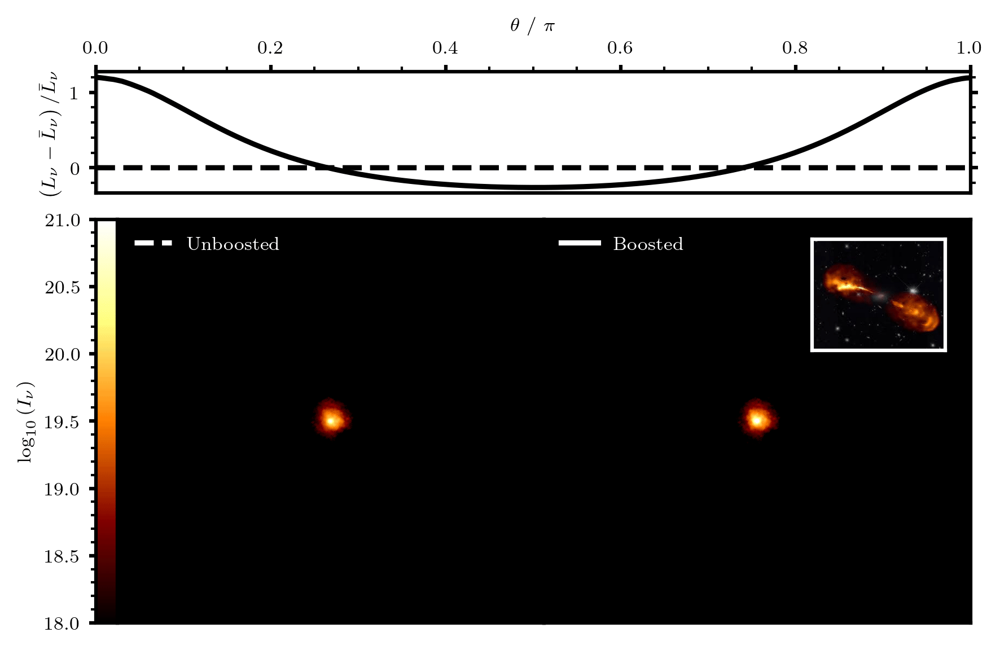
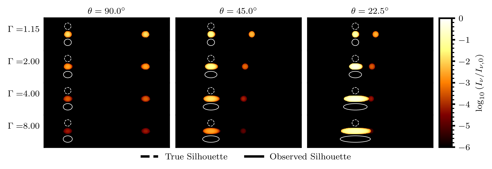
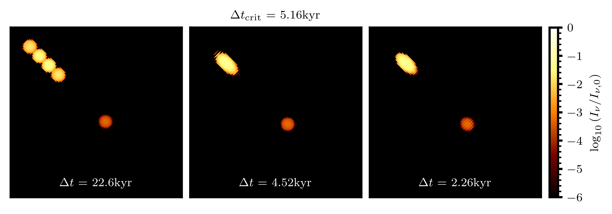

.. _phenomena:

Captured Phenomena
##################

In supporting realtivistic beaming and a finite speed of light, :code:`cuDART` is able to 
capture a wide range of relativstic and geometric effects that are crucial for comparing simulation
data with real observations. Here, we give examples of three phenomena recovered naturally by the :code:`cuDART` code:

1. :ref:`Relativistic Beaming <phenomena_beaming>`
2. :ref:`Superluminal Motion <phenomena_superluminal>`
3. :ref:`Morphological Deformation <phenomena_deformation>`

We also detail a non-physical phenomenon related to the user providing the render with snapshots too sparsely seperated in time

4. :ref:`Aliasing <phenomena_aliasing>`

.. _phenomena_beaming:

Relativistic Beaming
--------------------

Emmission that is isotropic in the emitter rest frame is beamed towards the emitter's direction of motion 
(see :ref:`this <calculation_header>` page for details). This means that the brightness of a source is dependent 
on its orientation. In the figure :ref:`below <phenomena_rotate_gif>`, an animation depicts a series of viewpoints rotated 
about hydrodynamic simulation data featuring a double-ended relativistic jet (data provided by `Elley et al. 2026 <https://ui.adsabs.harvard.edu/abs/2026MNRAS.546ag131E/abstract>`_). The total luminosity of the system
is plotted as a function of viewing angle in the top panel. In the lower panels, the simulation is rendered with relativistic 
beaming turned off and on (left and right respectively). For system without beaming, the totla luminosity is independent of 
the viewing angle, but for the right system, the luminosity peaks when one of the jets is pointed directly towards the 
observer (:math:`\theta \sim 0, \pi`). We can also see that in the right system, there is an asymmetry between the jets, as the end pointed toward the 
observer is brighter. 

.. _phenomena_rotate_gif:

This asymmetric morphology is consistent with real observations of relativistic jets launched from Active Galctic Nuclei. 
As asymmetry may also be driven by anistropy in the ambient environment, understanding the degree of asymmetry driven by 
relativistic beaming is crucial for comparing synthetic and real observations.
    
.. _phenomena_superluminal:

Superluminal Motion
-------------------

If an emitting region travelling close to the speed of light has a velocity component along the line of sight, the observed transverse motion
of the region will be different from the true transverse velocity, as the distance between the emitting region and the observer is changing. 
In order to capture this effect, :code:`cuDART` supports a finite speed of light in the tracing algorithm, reading in multiple simulation
snapshots in time to account for the non-zero communication time between emitter and observer. The figure :ref:`below <phenomena_superluminal_gif>` shows 
anti-parallel spherical (in the observer frame) ejecta launched at 90 and 45 degrees to the line of sight (left and right panels respectively). when
the ejecta's motion is perpendicular to the line-of-sight, both ejecta show the same observed velocity. However, when the ejecta is pointed slight towards/away
from the observer, the observed transverse velocity can be very different, even exceeding the speed of light. The observed shape of the approaching ejectum is 
no longer a sphere, this is also a geometric effect (see :ref:`next <phenomena_morphology>` secton).

.. _phenomena_superluminal_gif:

.. figure:: ../../gallery/superluminal.gif
    :width: 800px

Understanding geometric effects such as superluminal motion is especially important for transient observations of relativistic ejecta from 
X-ray binaries.

.. _phenomena_deformation:

Morphological Deformation
-------------------------

As shown in the superluminal example above, the natural and observed shapes of emitting regions can be very different. This is also due to the speed of light
being finite, as light from the far side of the emitting region takes longer to reach the observer, and so must have been emitted earlier (when the region was 
in a different location). This results in a smearing of the objects morphology along the line-of-sight. The figure :ref:`below <phenomena_deformation_png>` shows twin
ejecta travelling at various velocities (parameterised by the lorentz factor :math:`\Gamma`) and orientations to the line-of-sight :math:`\theta`. 

.. _phenomena_deformation_png:

We can see that while slow moving (:math:`\Gamma \sim 1`) ejecta are observed with their true shape (spheres in the observer frame), faster moving ejecta more closely
aligned to the line-of-sight exhibit smearing along their direction of motion, resulting in their observed shape taking the form of an ellipse. The degree of smearing captured
by the render routine is consistent with geometric predictions (shown as white ellipses); the ratio between observed and natural sizes being

.. math::

    \mathcal{L} \equiv \frac{L_\mathrm{obs}}{L_\mathrm{true}} = \frac{\sqrt{1-2\beta \cos(\theta)+\beta^2}}{1-\beta \cos(\theta)}

This ratio, as with superluminal motion, is maximised at the critical orientation :math:`\theta_\mathrm{crit} = \cos^{-1}(\beta)`. If the emitting region is a sphere in its
*own* rest-frame, then the effects of relativistic length contraction and geometric smearing cancel out, resulting the observed object also being a sphere; this is known as the 
`Penrose-Terrell <https://en.wikipedia.org/wiki/Terrell_rotation>`_ effect. This is also captured in :code:`cuDART`, if the emitting region is a sphere in its own rest frame, then
in the observer frame, it will be an oblate spheroid with a compression factor of :math:`\Gamma`. The figure below shows how such a spheroid would be imaged within :code:`cuDART`;
on the left :code:`lookback=False` and on the right :code:`lookback=True`. In the right panel we see 

.. _phenomena_aliasing:

Aliasing
--------

One source of smearing along the line-of-sight that is *not* a physical consequence of a finite communication between the emitter and observer is aliasing,
where snapshots provided to the render routine have too large a seperation in time. In this case, there may not be a suitably close simulation state for the
render to sample when using the :code:`lookback` routine. This will result in artificial deformation, and can even result in multiple images of the same region
if the sampling cadence is low enough. It can be shown that the critical sampling interval :math:`\Delta t_\mathrm{crit}` for resolving a region with characteristic
scale :math:`R` and velocity :math:`v` is the *observed* self-crossing time of the region, such the for unaliased rendering we require

.. math:: 

    \Delta t < \Delta t_\mathrm{crit} \equiv \frac{1 - \beta \cos(\theta)}{\sin(\theta)} \frac{R}{v}

Alternatively, for a given cadence of simulation data $\Delta t$, the user can predict the smallest possible length scale resolvable as a function of :math:`v` and :math:`\theta`:

.. math::

    R_\mathrm{min} = \frac{v\sin(\theta)\Delta t}{1 - \beta \cos(\theta)}

The figure below compares renders using simulation data sampled below, at and above the required frequency (left to right). It is clear that in the left panel,
the render is heavily aliased, with duplicate images of the emitting region appearing. This effect is diminished once the system is sampled at the 
critical frequency, and above the critical frequency, the proper observed shape of the emitting region is faithfully recovered.

.. _phenomena_alias:

