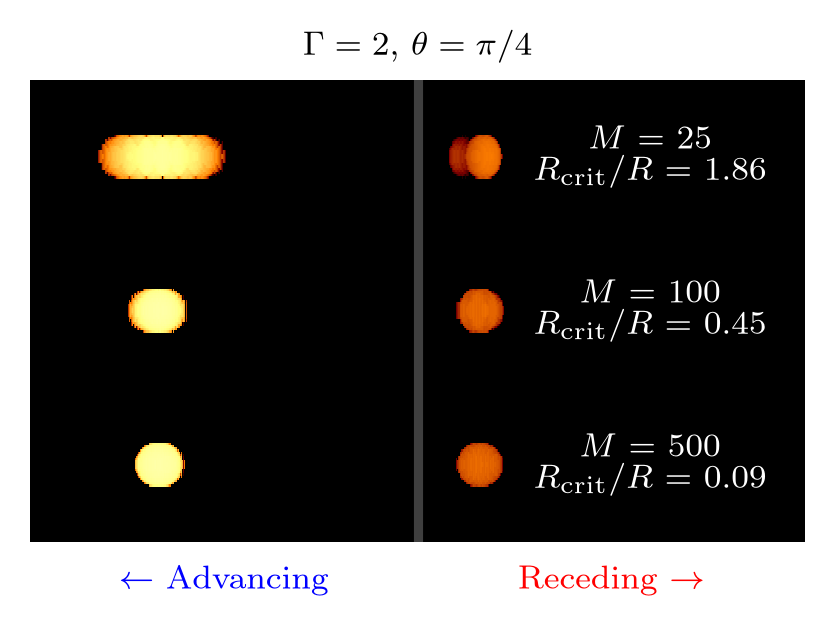

.. _phenomena_header:

Captured Phenomena
##################

In supporting relativistic beaming and a finite time delay, cuDART is able to 
capture a wide range of relativsitic and geometric effects that are crucial for comparing synthetic observations
with real sources. To demonstrate these effects, we consider a mock simulation dataset consisting of two
homogenous emitters travelling at :math:`\Gamma=2` (equivalent to :math:`v \sim 0.9c`) in opposite directions (anti-parallel motion). 
The emitters are spherical in their own rest frames, so in the mock dataset (which is spatially discretised in the lab-frame) they are oblate spheroids with an axial ratio of :math:`1/\Gamma`.
In the figure below, we compare renders taken of this system when it is viewed at an angle :math:`\theta = \pi/4` to the advancing ejectum's 
direction of motion. The scene is rendered under three different treatments, shown in the right three panels:

A. Rendered without relativistic beaming, and without lookback
B. Rendered with relativistic beaming, but without lookback
C. Rendered with relativistic beaming and lookback

It should be immediately clear that the three treatments produce very different observations; we discuss these discrepancies and their origin in the sections below.

.. _phenomena_figure:

.. figure:: ../../gallery/phenomena_comp.gif
    :width: 800px

    Comparison of images rendered from mock data featuring relativistic anti-parallel ejecta imaged with/without relativistic beaming and with/without the lookback implementation. 
    Without lookback, rendering is performed using a single simulation snapshot. With lookback, multiple snapshots are scanned to account for a finite communication time between emission and observation.
    In the left panel, we show the observed transverse motion for systems with/without lookback. In the right panels, we show the synthetic observations generated under different routines at a time given by the grey dashed line in the left panel. 
    Without beaming, the advancing and receding ejecta have the same brightness; when beaming is included the advancing ejecta is substantially brighter (shown by the flux ratio :math:`\mathcal{S}\equiv S^\mathrm{adv}_\nu/S^\mathrm{rec}_\nu`). 
    Without lookback, the ejecta exhibit symmetric transverse motion (:math:`\beta_\mathrm{T}\sim0.6`) and are imaged as ellipses, coherent with their oblate spheroid lab-frame morphology. 
    When lookback is included, the proper asymmetric transverse motion is captured, with the advancing ejectum appearing to move faster (:math:`\beta_\mathrm{T}\sim 1.6`) than the receding ejectum (:math:`\beta_\mathrm{T}\sim0.4`). 
    Further, the ejecta are observered as circular, consistent with the relativistic/geometric predictions of the Penrose-Terrell effect (see :ref:`below <phenomena_deformation>`), and exhibit the proper flux ratio (see :ref:`below <phenomena_flux>`).

.. _phenomena_beaming:

Relativistic Beaming
--------------------

Routine :math:`A` and :math:`B` in the above :ref:`figure <phenomena_figure>` compare renders either directly tracing the rest frame emissivity or tracing the emissivity boosted into the lab frame. 
In their own rest frames, the advancing and receding are identical, so when beaming is neglected the two ejecta exhibit the same brightness. 
Once beaming is included this symmetry is broken and the advancing ejectum is significant brighter due to the beaming of radiation toward the observer. 
Similarly, the receding ejecta is dimmer than the beaming-less case, as the emission is being beamed away from the observer. 
Comparing the flux (:math:`S_\nu \propto \int I_\nu dA`) emitted by the advancing and receding ejecta in the beamed case :math:`B` gives a ratio of :math:`\mathcal{S}\equiv S^\mathrm{adv}_\nu / S^\mathrm{rec}_\nu \sim40`, 
set by the :math:`D^{2-\alpha}` scaling that enters into the intensity integral (see :ref:`here <calculation_header>`). 
This is actually still the incorrect flux ratio, the true value is only recovered by routine :math:`C` which also accounts for finite time delay (lookback), see :ref:`below <phenomena_flux>`.

.. _phenomena_superluminal:

Transverse Motion
-----------------
A textbook consequence of the finite travel time of light is a discrepancy between the true and observed transverse motion for an emitting region. 
This is most obvious when the true velocity of the region is directed partially toward the observer; because the distance between emitter and observer is decreasing, the observed transverse motion is larger than reality. 
For an object travelling at :math:`\beta = v/c` at an inclination of :math:`\theta` to the observer's line-of-sight, the apparent transverse velocity of the object :math:`\beta_\mathrm{T}` takes the form

.. math::

    \beta_\mathrm{T} =  \frac{\beta\sin\left(\theta\right)}{1-\beta\cos\left(\theta\right)}.

While the true velocity is constrained to :math:`\beta \in [0,1]` by relativity, the observer velocity is extremised with respect to :math:`\theta` at :math:`\theta_\mathrm{crit}=\cos^{-1}(\beta)`; at this orientation :math:`\beta_\mathrm{T}=\Gamma \beta`. 
Hence, for :math:`\beta > 1/\sqrt{2}`, there exist orientations :math:`\theta \sim \theta_\mathrm{crit}` where :math:`\beta_\mathrm{T} > 1`. In this scenario, the object appears to be moving faster than the speed of light (termed superluminal motion). 
This result is only recoverable when a finite time delay is accounted for, hence synthetic observations which assume infinitesimal communication time between source and observer fail to report the proper transverse motion. 
The left panel of the above :ref:`figure <phenomena_figure>` shows the observed displacement of twin-ejecta moving at fixed velocity, with the right panels comparing renders made with and without lookback. 
Without lookback (:math:`A` and :math:`B`), both ejecta are observed to have the same transverse speed (dashed lines in left panel), but with lookback (:math:`C`), they exhibit the proper asymmetric motion with the approaching ejecta appearing to travel faster than the receding (solid lines in left panel). 

.. _phenomena_deformation:

Morphological Deformation
-------------------------
As discussed in the previous section, allowing for a finite light travel time between emitter and observer can result in different observed motions. Similarly, the difference in light travel time between the near and far surfaces of 
an emitting region can result in morphological differences between the emitter structure as measured in the lab frame and as observed. This delay introduces an observable deformation in the emitter's geometry along its direction of 
motion, as the far surface is observed earlier in the object's motion than the near surface. As first discussed by `Penrose 1959 <https://ui.adsabs.harvard.edu/abs/1959PCPS...55..137P/abstract>`_ and `Terrell 1959 <https://ui.adsabs.harvard.edu/abs/1959PhRv..116.1041T/abstract>`_ 
(and hence known as the Penrose-Terrell effect), this deformation opposes the size change imparted by Lorentz contraction, resulting in the observed size of the region matching the measurement made in the emitter's rest frame. 
In the scenario discussed by Penrose and Terrell, an emitter that is spherical in its own rest frame, while Lorentz contracted in the lab frame, is *observed* to be spherical due to the differential lag time between near and far surfaces of the sphere. 
An image of the sphere would appear to be rotated toward the direction of motion: in the limit of :math:`\beta \rightarrow 1`, the closest point on the sphere would appear to be the most displaced along the sphere's direction of motion. 
This rotation is invisible for the homogenous emitter used in this mock data set, see `this <https://upload.wikimedia.org/wikipedia/commons/d/d3/Terrell_Rotation_Sphere.gif?utm_source=en.wikipedia.org&utm_campaign=imageinfo&utm_content=original>`_ animation for a schematic example of this effect. 
The right two panels of the :ref:`above figure <phenomena_figure>` (:math:`A` and :math:`B`) make clear the importance of accounting for this lag time: failing to include lookback results in an image depicting (incorrectly), an elliptical emitter due to the lab-frame oblate spheroid structure. 
When lookback is included (:math:`C`), the proper circular observation is recovered, as predicted by Penrose and Terrell. 

.. _phenomena_flux:

Observed Flux
-------------

Each render in the above :ref:`figure <phenomena_figure>` also compares the ratio of flux between advancing and receding ejecta. A standard result for discrete emission is that the rest-frame flux and observer flux for a source of homogeneous velocity are related by

.. math::

    S_\nu = \int I_\nu d\Omega = \frac{D^{3-\alpha}}{L^2}\int j'_{\nu'}dV' \propto D^{3-\alpha}

where we have used the Lorentz invariance of :math:`I_\nu / \nu^3` and :math:`d\Omega=dA'/L^2` (the solid angle for a source at a distance :math:`L` to the observer): see `Lind et al. 1985 <https://ui.adsabs.harvard.edu/abs/1985ApJ...295..358L/abstract>`_ for a full derivation. 
The ejecta travelling towards/away from the observer have identical structure in their own rest frames (labelled with primes), so the ratio of fluxes :math:`S_\nu` between advancing and receding ejecta should take the form

.. math::

    \mathcal{S}\equiv\frac{S_\nu^\mathrm{adv}}{S_\nu^\mathrm{rec}} = \left(\frac{D^\mathrm{adv}}{D^\mathrm{rec}} \right)^{3-\alpha} = \left(\frac{1+\beta \cos(\theta)}{1-\beta \cos(\theta)}\right)^{3-\alpha}

The flux ratio for all three cases is calculated by integrating over the pixels for the advancing and receding ejecta. When beaming is neglected (:math:`A`), the ratio is simply unity as both ejecta are identical in the lab-frame. 
When beaming is included, but lookback is neglected (:math:`B`), the flux ratio is still incorrect; while on a cell-by-cell basis the emissivity has been properly boosted into the observer frame, by failing to track the proper emission morphology the total emergent flux has also been miscalculated. 
In contrast, when lookback is included (:math:`C`), the ratio of fluxes matches the theoretical result to within :math:`0.2\%`. 

.. _phenomena_summary:

Summary
-------

============ ================ ======== =========================================================== ========== ==============================
Method       Doppler Boosting Lookback Observed Velocity :math:`\beta_\mathrm{T}`                  Morphology Flux Ratio :math:`\mathcal{S}`
============ ================ ======== =========================================================== ========== ==============================
:math:`A`    Off              Off      :math:`\pm \beta\sin(\theta)`                               Elliptical 1.00
:math:`B`    On               Off      :math:`\pm \beta\sin(\theta)`                               Elliptical 40.70
:math:`C`    On               On       :math:`\frac{\pm \beta\sin(\theta)}{1\mp\beta\cos(\theta)}` Circular   169.04
Theory                                 :math:`\frac{\pm \beta\sin(\theta)}{1\mp\beta\cos(\theta)}` Circular   169.27
============ ================ ======== =========================================================== ========== ==============================

The table above summarises the observational phenomena recoverable from the mock dataset under different rendering routines (:math:`A`, :math:`B` and :math:`C`), and compares the observables to theoretical predictions.
It should be clear from discusssion above that while boosting the rest-frame emissivity to the lab frame is a requirement for imaging, alone it is insufficient to recover the full relativistic and geometric observational predictions. 
Only by including this boosting and accounting for a finite communication time between an emitting region and the observer can accurate synthetic observations be formed. This finite communication time, termed lookback in the cuDART framework, is included by default, requiring the user to provide a series of simulation snapshots in time.

The toy model used to demonstrate these discrepancies features emitting regions which are static in their own rest frames (the emissivity of each region does not change, their velocity is constant and their shape unchanged). 
In using this simple toy model, we can make direct comparison to known theoretical results for the expected motion, morphology and fluxes. In a less idealised astrophysical setting, none of these static properties are assured and 
there may exist no tractable analytical expectations. Such cases require numerical calculation to generate accurate observations.

It is important to note that in some systems it is reasonable to ignore the finite speed of light. If the morphology of a source (as defined in the lab frame), evolves slowly compared to its light self-crossing time, then the communication time between source and observer can be treated as effectively instantaneous and rendering can be performed on a snapshot-by-snapshot basis. 
In the language of `Lind et al. 1985 <https://ui.adsabs.harvard.edu/abs/1985ApJ...295..358L/abstract>`_, this is equivalent to treating the lab-frame as the pattern frame. This assumption is reasonable for some large-scale AGN jet structure, as the advance speeds of jets into the circum-galactic medium is usually much slower than the speed of light. 
However, caution is warranted when visualising rapidly evolving structures, such as knots in the jet beam, or comparing between the advancing and receding jets at late times as here the light time delay can become significant. Authentic visualisation of such structures will require schemes which account for a finite speed of light.

.. _phenomena_aliasing: 

Aliasing
--------

High quality synthetic observations require simulation data that is finely sampled in both space and time. Without lookback, a single simulation snapshot is sufficient but with lookback included, multiple simulations snapshots must be read to determine the system state cross various epochs. 
If these snapshots are too sparsely spaced in time, the renderer will not have enough information to accurately recover the simulation state between snapshots, resulting in artificial smearing and even aliasing. This effect becomes significant when the sampling interval for the simulation state is greater than the *observed* self-crossing time of an emitting element. 
If the user wishes to resolve a region with characteristic length scale :math:`R` and velocity :math:`v`, the sampling interval :math:`\Delta t` should satisfy

.. math:: 

    \Delta t < \Delta t_\mathrm{crit} \equiv \frac{1 - \beta \cos(\theta)}{\sin(\theta)} \frac{R}{v}

Alternatively, for a given cadence of simulation data :math:`\Delta t`, the user can determine the minimum length scale resolvable by the rendering routine as 

.. math::

    R_\mathrm{min} = \frac{v\sin(\theta)\Delta t}{1 - \beta \cos(\theta)} = v_\mathrm{T}\Delta t

The smallest resolvable scale is then the observed distance traversed by the emitter in the interval between snapshots. 
The figure below compares renders using simulation data written with increasing cadence, for anti-parallel ejecta with radius :math:`R`. 
When rendering using only a small number of snapshots :math:`M`, the interval between snapshots is large and the resolved radius exceeds the size of the emitter, 
resulting in strong smearing and the appearance of multiple images (aliasing). At higher cadences, these aliased images are lost and the degree of smearing reduces. 
For :math:`M=500`, the resolved radius is much smaller than the size of the emitter, resulting in accurate recovery of the observed spherical structure.

.. _phenomena_alias:

