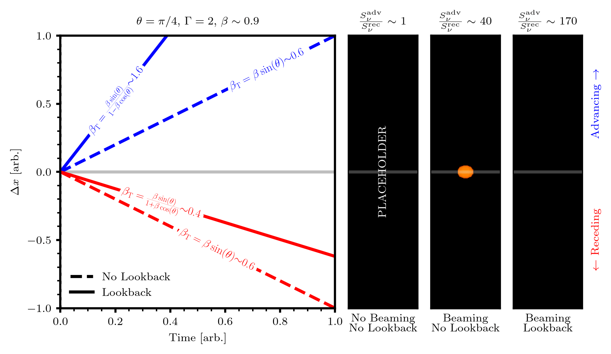

.. _phenomena:

Captured Phenomena
##################

In supporting realtivistic beaming and a finite speed of light, :code:`cuDART` is able to 
capture a wide range of relativstic and geometric effects that are crucial for comparing simulation
data with real observations. To demonstrate these effects, we utilise a mock simulation dataset consisting of two
homogenous emitters travelling at :math:`\Gamma=2` (equivalent to :math:`v \sim 0.9c`) in opposite directions (antiparallel). 
The emitters are spherical in their own rest frames, so in the lab-frame they are oblate spheroids with an axial ratio of :math:`1/\Gamma`.
In the figure below, we compare renders taken of this system when it is viewed at an angle :math:`\theta = \pi/4` to the advancing ejectum's 
direction of motion. The scene is rendered under three different treatments, showin the the three right panels:

1. Rendered without relativistic beaming, and without lookback
2. Rendered with relativistic beaming, but without lookback
3. Rendered with relativistic beaming and lookback

It is clear that the three treatments produce significantly different observations, we discuss the discrepancies and their origin in the sections below.

.. _phenomena_beaming:

Relativistic Beaming
--------------------

.. _phenomena_superluminal:

Observed Motion
---------------

.. _phenomena_deformation:

Morphological Deformation
-------------------------

.. _phenomena_flux:

Observed Flux
-------------

.. _phenomena_summary:

Summary
-------

It should be clear from discusssion above that while boosting the rest-frame emissivity to the lab frame is a requirement for imaging, alone it is insufficient to recover the full relativistic and geometric observational predictions. 
Only by including this beaming and accounting for a finite communication time between an emitting region and the observer can accurate synthetic observations be formed. This finite communication time, termed lookback in the :code:`cuDART`` framework, is included by default, requiring the user to provide a series of simulation snapshots in time.
The toy model used to demonstrate these discrepancies features an emitting region that is static in its own rest frame (the emissivity of the region does not change, the velocity is constant and the shape unchanged). In using this simple toy model, we can make direct comparison to known theoretical results for the expected motion, morphology and fluxes. 
In a less idealised astrophysical setting, none of these static properties are assured and there may exist no tractable analytical expectations. Such cases require numerical calculation to generate observations. 
It is important to note that in some systems it is reasonable to ignore the finite speed of light. If the morphology of a source (as defined in the lab frame), evolves slowly compared to its light self-crossing time, then the communication time between source and observer can be treated as effectively instantaneous and rendering can be performed on a snapshot-by-snapshot basis. 
In the language of Lind et al. 1985, this is equivalent to treating the lab-frame as the pattern frame. This assumption is reasonable for some large-scale AGN jet structure, as the advance speeds of jets into the circum-galactic medium is usually much slower than the speed of light. 
However, caution is warranted when visualising rapidly evolving structures, such as knots in the jet beam, or comparing between the advancing and receding jets at late times as here the light time delay can become significant. Authentic visualisation of such structures will require schemes which account for a finite speed of light.

.. _phenomena_aliasing: 

Aliasing
--------

One source of morphological deformation along the line-of-sight that is *not* a physical consequence of a finite communication between the emitter and observer is aliasing. 
Aliasing occurs when the snapshots provided to the render routine have too large a seperation in time (too low a cadence). 
In this case, there may not be a suitably close simulation state for the render to sample when using the :code:`lookback` routine. 
This will result in artificial deformation, and can even result in multiple images of the same region
if the sampling cadence is low enough. It can be shown that the critical sampling interval :math:`\Delta t_\mathrm{crit}` for resolving a region with characteristic
scale :math:`R` and velocity :math:`v` is the *observed* self-crossing time of the region, such the for unaliased rendering we require

.. math:: 

    \Delta t < \Delta t_\mathrm{crit} \equiv \frac{1 - \beta \cos(\theta)}{\sin(\theta)} \frac{R}{v}

Alternatively, for a given cadence of simulation data :math:`\Delta t`, the user can predict the smallest possible length scale resolvable as a function of :math:`v` and :math:`\theta`:

.. math::

    R_\mathrm{min} = \frac{v\sin(\theta)\Delta t}{1 - \beta \cos(\theta)}

The figure below compares renders using simulation data sampled below, at and above the required frequency (left to right). It is clear that in the left panel,
the render is heavily aliased, with duplicate images of the emitting region appearing. This effect is diminished once the system is sampled at the 
critical frequency, and above the critical frequency, the proper observed shape of the emitting region is faithfully recovered.

.. _phenomena_alias:

.. figure:: ../../gallery/alias.png
    :width: 800px