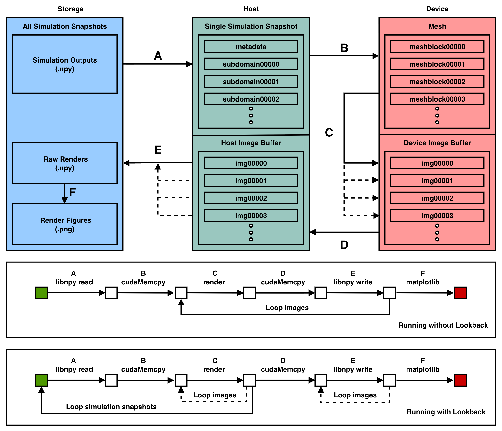

.. _structure_header:

Code Structure
##############

As render duration generally represents a small fraction of the total C++ execution ovserhead, 
cuDART prioritises minimising the number of read/writes made from storage to memory, and the number of transfers between host RAM and device VRAM. 
Below, we show the full execution chronology for a rendering call using the lookback routine to generate a series of images. We do not show the 
optional Pythonic frontend (see :ref:`documentation <python_api_header>`). 

.. _strucutre_png:

The chronology of execution is as follows:

A. The code utilises the :code:`libnpy` library to read a single snapshot of the simulation state into memory from a :code:`.npy` file. This is generally the slowest step, with execution largely dependent on the file system
B. The simulation snapshot is copied from the host memory to the device, and containerised into a :code:`Mesh` with child :code:`MeshBlocks`
C. The render kernel is executed on the simulation snapshot, for a single observation/image 

    * Repeat render kernel for all observers
    * Once observations complete, load next simulation snapshot and repeat (A,B,C)
    
D. Once all simulation snapshots have been processed, copy image data from device to host
E. Write image data as :code:`.npy` files to storage
F. Optionally, convert raw images into :code:`.png` figures using the Pythonic frontend
